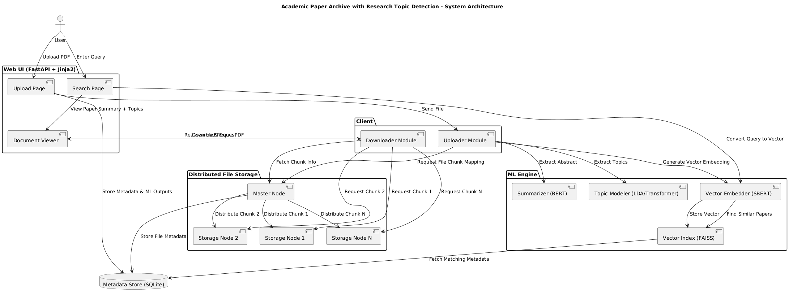

# 📚 Academic Paper Archive with Research Topic Detection

A research-centric web application that allows users to upload academic papers (PDFs), automatically extract summaries and topics using Machine Learning, and store them in a custom-built distributed file storage system. Semantic search is enabled using Sentence Transformers and FAISS for lightning-fast and accurate retrieval of related papers.


<p float="left">


</p>

---

## 🚀 Features

- 🧠 **Abstract Summarization** using BERT
- 🏷️ **Topic Detection** with LDA or Transformer models
- 🔍 **Semantic Search** powered by FAISS and Sentence Transformers
- 🗄️ **Distributed File Storage System** (no IPFS dependency)
- 📄 **Metadata Storage** using SQLite
- 💻 **Web UI** built with FastAPI and Jinja2
- 🔁 **Replication** for fault tolerance
- 📦 Chunked file upload & download

---

## 📂 Project Structure

```
academic-paper-archive/
│
├── master/                 # Master node for DFS
│   └── main.py
│
├── storage_node/           # First Storage Node
│   └── node.py
├── storage_node_2/         # Second Storage Node
│   └── node.py
│
├── client/                 # Upload & download logic
│   ├── uploader.py
│   ├── downloader.py
│   └── downloads/
│
├── ml_engine/              # ML models for summarization & topic modeling
│   ├── summarizer.py
│   ├── topic_model.py
│   └── vector_store.py
│
├── metadata/               # Metadata and database logic
│   └── db.py
│
├── web_ui/                 # FastAPI + Jinja2 based web frontend
│   ├── main.py
│   ├── templates/
│   │   ├── upload.html
│   │   └── results.html
│   └── static/
│  
├── start.bat
└── README.md
```

---

## ⚙️ Installation

### Prerequisites

- Python 3.8+
- pip

### Clone and Install

```bash
git clone https://github.com/your-repo/academic-paper-archive.git
cd academic-paper-archive
pip install -r requirements.txt
```

---

## 🧠 Run ML Modules

Preload BERT, LDA, Sentence Transformer, and FAISS Index in background:

```bash
# (Optional) Train or pre-generate LDA models
python ml_engine/topic_model.py

# Prepare FAISS vector store
python ml_engine/vector_store.py
```

---

## 🗄️ Start Distributed File Storage

```bash
# Run the cmd file
start.bat
```
---

## 🌐 Start Web Interface

Visit `http://localhost:8000`

---

## 📥 Upload Flow

1. User uploads PDF via web interface.
2. File is split and chunks distributed across nodes.
3. BERT extracts a summary; topics are inferred via LDA or Transformer.
4. Embeddings are generated for semantic search.
5. Metadata and vector index updated.
6. User receives confirmation.

---

## 🔍 Search Flow

1. User types query (e.g., "quantum computing papers").
2. SentenceTransformer embeds the query.
3. FAISS searches for nearest vectors.
4. Results fetched from SQLite and displayed.

---

## 🔷 Diagram



## 📊 Tech Stack

| Component        | Technology                   |
|------------------|------------------------------|
| Language         | Python                       |
| Frontend         | FastAPI + Jinja2             |
| ML Models        | BERT, Sentence Transformers  |
| Topic Modeling   | Transformers   |
| Vector Search    | FAISS                        |
| Storage System   | Custom DFS (chunk-based)     |
| Database         | SQLite                       |


---

## 🐛 Known Issues

- Upload may fail if a node is not running.
- FAISS index needs to be rebuilt if server is restarted (unless stored).
- Semantic search may be slow with large data unless optimized.

---

## 🔮 Future Improvements

- Multi-user authentication
- Paper citation graph / visualization
- Upload versioning
- Email notifications for matched papers
- Dockerization and deployment

---

## 📜 License

MIT License

---

## 📚 References

- BERT Paper: [https://arxiv.org/abs/1810.04805](https://arxiv.org/abs/1810.04805)
- FAISS: [https://github.com/facebookresearch/faiss](https://github.com/facebookresearch/faiss)
- Sentence Transformers: [https://www.sbert.net/](https://www.sbert.net/)

---

## 🙌 Author

**Ravi Kishan**  
📧 ravikishan63392@gmail.com
